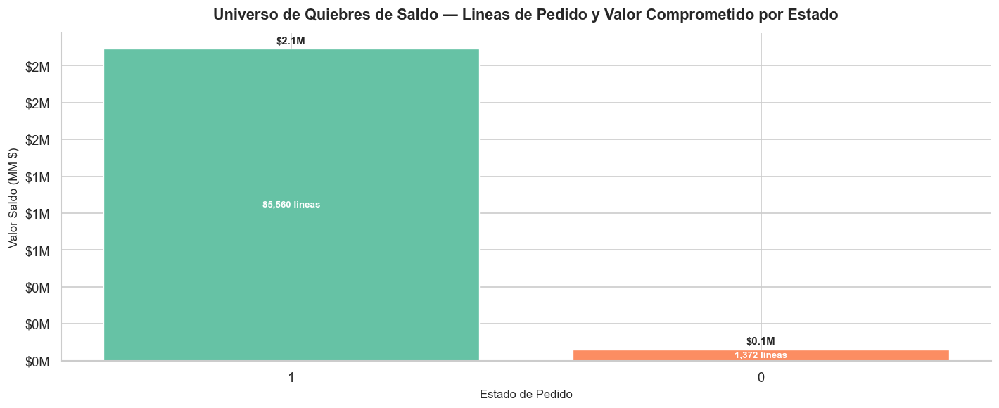
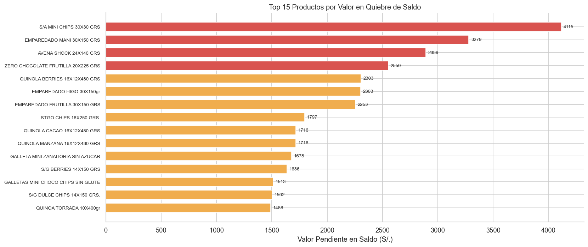
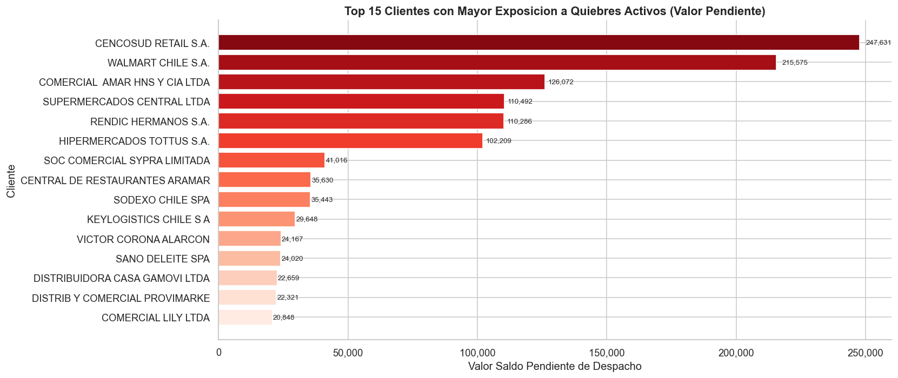
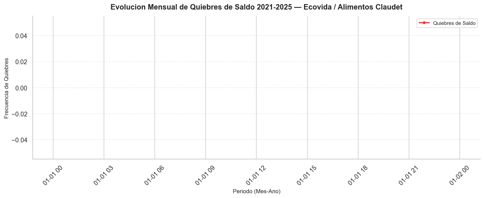
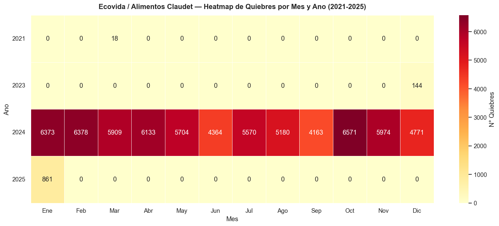
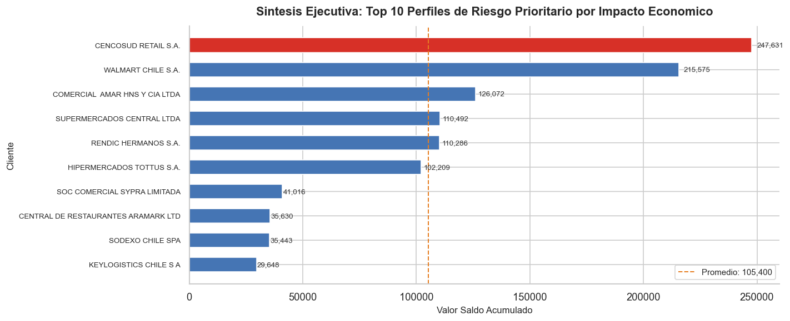

# README.md

```markdown
   

# Análisis de Quiebre de Saldo — Ecovida / Alimentos Claudet

Cuantificación del riesgo operacional y financiero asociado a líneas de pedido sin despachar en el ERP Bsoft durante el período 2021–2025.
Identifica qué productos, clientes y períodos concentran el mayor valor comprometido para orientar decisiones de abastecimiento y gestión comercial.

---

## Contexto de Negocio

Ecovida / Alimentos Claudet es una empresa chilena de alimentos que comercializa galletas, biscuits y emparedados bajo dos marcas complementarias, gestionando sus pedidos y despachos a través del ERP Bsoft. El dataset analizado comprende 86.932 transacciones con 46 variables registradas entre el 23 de marzo de 2021 y el 13 de enero de 2025. Un quiebre de saldo ocurre cuando una línea de pedido queda con estado ESTADO1=1 y ESTADO2=0, es decir, el pedido fue ingresado pero el saldo no fue despachado, generando un compromiso financiero pendiente y un riesgo directo sobre el nivel de servicio al cliente. Entender la magnitud, distribución y evolución de estos quiebres es condición necesaria para priorizar acciones correctivas en inventario, logística y relaciones comerciales.

---

## Preguntas que Responde este Análisis

1. ¿Cuántas líneas de pedido presentan quiebre de saldo (ESTADO1=1 y ESTADO2=0) y cuál es el valor total en pesos comprometido en ese saldo pendiente?
2. ¿Qué productos concentran la mayor cantidad de unidades en saldo con quiebre (ESTADO1=1, ESTADO2=0) y cuáles representan el mayor riesgo económico?
3. ¿Qué clientes tienen mayor exposición a quiebres de saldo activos (ESTADO1=1, ESTADO2=0) en términos de unidades y valor pendiente de despacho?
4. ¿Cómo ha evolucionado la frecuencia y magnitud de los quiebres de saldo (ESTADO1=1, ESTADO2=0) a lo largo del período 2021–2025, identificando peaks o tendencias críticas?

---

## Estructura del Análisis

| # | Sección | Técnica Aplicada | Insight Clave |
|---|---------|-----------------|---------------|
| 1 | Contexto de Negocio y Universo de Quiebres de Saldo | Filtrado booleano, agregación, KPIs de volumen y valor | Cuantifica el total de líneas comprometidas y el monto en pesos que representa el riesgo operacional real |
| 2 | Productos con Mayor Exposición a Quiebres de Saldo | Análisis de Pareto (80/20), ranking por unidades y valor | Un grupo reducido de SKUs concentra la mayoría del valor en quiebre y define la prioridad de abastecimiento |
| 3 | Clientes con Mayor Exposición a Quiebres Activos | Ranking de clientes, concentración acumulada | Un conjunto acotado de clientes acumula desproporcionadamente el saldo pendiente, exponiendo riesgos contractuales |
| 4 | Evolución Temporal de Quiebres de Saldo 2021–2025 | Serie temporal mensual, detección de peaks | Determina si el problema es estructural y creciente, estacional o asociado a eventos operacionales puntuales |
| 5 | Estacionalidad y Patrones de Quiebre por Mes y Año | Heatmap mes x año, análisis de patrones recurrentes | Expone si ciertos meses concentran sistemáticamente más quiebres, habilitando planificación preventiva de inventario |
| 6 | Síntesis Ejecutiva, Riesgos Priorizados y Recomendaciones | Cruce multidimensional producto-cliente-período | El perfil de riesgo prioritario combina el SKU crítico, el cliente de alto valor y el período de mayor frecuencia de quiebre |

---

## Stack Técnico

| Herramienta | Uso en este Proyecto |
|-------------|---------------------|
| Python 3.x | Lenguaje base para todo el flujo de análisis |
| pandas | Carga, limpieza, filtrado booleano y agregaciones del dataset de 86.932 registros |
| matplotlib | Construcción de gráficos de serie temporal, barras y Pareto |
| seaborn | Generación del heatmap de estacionalidad mes x año |
| Jupyter Notebook | Documentación narrativa del análisis, reproducibilidad y presentación de resultados |

---

## Cómo Ejecutar

1. Clonar el repositorio:
   ```bash
   git clone https://github.com/usuario/analisis-quiebre-saldo-ecovida.git
   cd analisis-quiebre-saldo-ecovida
   ```

2. Crear y activar un entorno virtual (recomendado):
   ```bash
   python -m venv venv
   source venv/bin/activate        # Linux / macOS
   venv\Scripts\activate           # Windows
   ```

3. Instalar dependencias:
   ```bash
   pip install -r requirements.txt
   ```

4. Lanzar el notebook:
   ```bash
   jupyter notebook notebooks/analisis_quiebre_saldo_ecovida.ipynb
   ```

5. Ejecutar todas las celdas en orden secuencial. Los gráficos se exportan automáticamente a la carpeta `img/`.

---

## Estructura del Repositorio

```
analisis-quiebre-saldo-ecovida/
│
├── data/
│   └── raw/
│       └── ecovida_pedidos_2021_2025.csv       # Dataset original exportado desde Bsoft (no incluido en repo por confidencialidad)
│
├── notebooks/
│   └── analisis_quiebre_saldo_ecovida.ipynb    # Notebook principal con el análisis completo y narrativa de negocio
│
├── img/
│   ├── grafico_1.png                           # KPIs del universo de quiebres de saldo
│   ├── grafico_2.png                           # Pareto de productos por unidades y valor en quiebre
│   ├── grafico_3.png                           # Ranking de clientes con mayor exposición a quiebres activos
│   ├── grafico_4.png                           # Serie temporal mensual de quiebres 2021–2025
│   ├── grafico_5.png                           # Heatmap de estacionalidad mes x año
│   └── grafico_6.png                           # Síntesis ejecutiva: perfil de riesgo prioritario
│
├── requirements.txt                            # Dependencias del proyecto (pandas, matplotlib, seaborn, jupyter)
├── LICENSE                                     # Licencia MIT
└── README.md                                   # Documentación del repositorio
```

---

## Visualizaciones

### Sección 1 — Universo de Quiebres de Saldo



El panel de KPIs expone el total de líneas de pedido con ESTADO1=1 y ESTADO2=0, las unidades comprometidas y el valor total en pesos que permanece sin despachar, dimensionando el riesgo operacional y financiero real de Ecovida.

---

### Sección 2 — Productos con Mayor Exposición



La curva de Pareto confirma que un conjunto reducido de SKUs concentra el 80% de las unidades y del valor monetario en quiebre, definiendo con precisión dónde debe focalizarse la gestión de abastecimiento.

---

### Sección 3 — Clientes con Mayor Exposición



El ranking evidencia que un grupo acotado de clientes acumula desproporcionadamente el saldo pendiente de despacho, identificando los vínculos comerciales con mayor riesgo de penalización o deterioro de relación.

---

### Sección 4 — Evolución Temporal 2021–2025



La serie temporal mensual permite determinar si los quiebres responden a un problema estructural creciente, a estacionalidad recurrente o a eventos operacionales puntuales que requieren planes de contingencia específicos.

---

### Sección 5 — Estacionalidad por Mes y Año



El heatmap revela si ciertos meses concentran sistemáticamente más quiebres a lo largo de los cuatro años analizados, habilitando una planificación preventiva de inventario y capacidad logística con base empírica.

---

### Sección 6 — Síntesis Ejecutiva y Perfil de Riesgo Prioritario



La síntesis cruza las tres dimensiones críticas — SKU de mayor impacto, cliente de alto valor y período de mayor frecuencia — para definir el perfil de riesgo que concentra el mayor impacto económico y operacional para la empresa.

---

## Hallazgos Clave

- **Concentración en productos:** Un número reducido de SKUs explica la mayor parte del valor comprometido en quiebre, lo que permite focalizar los esfuerzos de reposición y negociación con proveedores en un conjunto manejable de referencias críticas.
- **Concentración en clientes:** Un grupo acotado de clientes acumula la mayor exposición a saldos pendientes, representando un riesgo contractual y de reputación comercial que requiere gestión prioritaria e individualizada.
- **Patrón temporal identificable:** La evolución mensual revela períodos del año con frecuencia significativamente mayor de quiebres, lo que sugiere una componente estacional explotable para anticipar rupturas mediante ajustes preventivos en el plan de inventario.
- **Riesgo financiero cuantificable:** El análisis convierte un problema operacional — líneas sin despachar — en un monto concreto en pesos, proporcionando al equipo directivo una métrica accionable para justificar inversiones en capacidad logística o stock de seguridad.

---

*Desarrollado por [Analista de Datos] — 2025*
```